# Documentación de Instalación de Apache, MariaDB, PHP en Ubuntu

## 1. Actualización del repositorio y paquetes
Para asegurarnos de que el sistema está actualizado, primero debemos ejecutar los siguientes comandos:

```bash
sudo apt update
```
Este comando actualiza la lista de paquetes disponibles desde los repositorios.

Luego, para actualizar todos los paquetes instalados en el sistema a la última versión disponible, ejecutamos:

```bash
sudo apt upgrade
```
## 2. Instalación del servidor Apache

Para instalar el servidor web Apache en Ubuntu, utilizamos el siguiente comando:
```bash
sudo apt install apache2
```
Una vez finalizada la instalación, el servicio de Apache debería iniciar automáticamente. Para verificar que Apache está funcionando correctamente, puedes ingresar la dirección IP del servidor o http://localhost en tu navegador.

## 3. Instalación del servidor de base de datos MariaDB

MariaDB es un reemplazo de MySQL y se instala de manera similar. Para instalar MariaDB en Ubuntu, utilizamos el siguiente comando:
```bash
sudo apt install mariadb-server mariadb-client
```
Este comando instalará tanto el servidor como el cliente de MariaDB. Después de la instalación, el servidor MariaDB debería iniciarse automáticamente.
Verificación del estado de MariaDB

Para comprobar que MariaDB se está ejecutando, utilizamos el siguiente comando:
```bash
sudo systemctl status mariadb
```
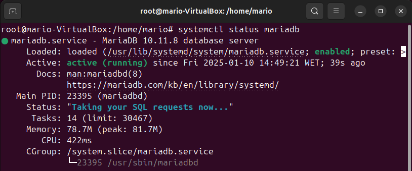

### Configuración para que MariaDB inicie automáticamente

Para asegurarnos de que MariaDB se inicie automáticamente al arrancar el sistema, ejecutamos el siguiente comando:
```bash
sudo systemctl enable mariadb
```
### Verificación de la versión de MariaDB

Para comprobar la versión instalada de MariaDB, utilizamos el siguiente comando:
```bash
mysql --version
```
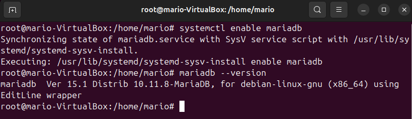

### Ejecución del script de seguridad posterior a la instalación

MariaDB ofrece un script para asegurar la instalación. Ejecutamos el siguiente comando:
```bash
sudo mysql_secure_installation
```
Durante este proceso, cuando se nos pida la contraseña de root de MariaDB, presionamos Enter ya que aún no hemos configurado una contraseña. Luego, configuramos nuestra nueva contraseña de root para MariaDB.
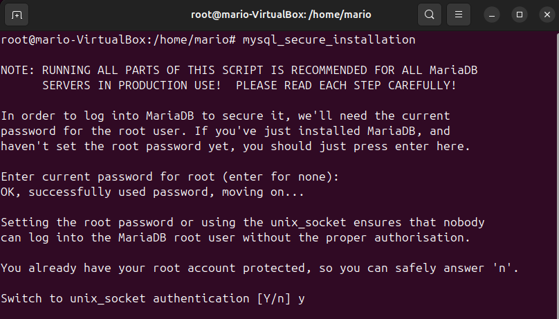
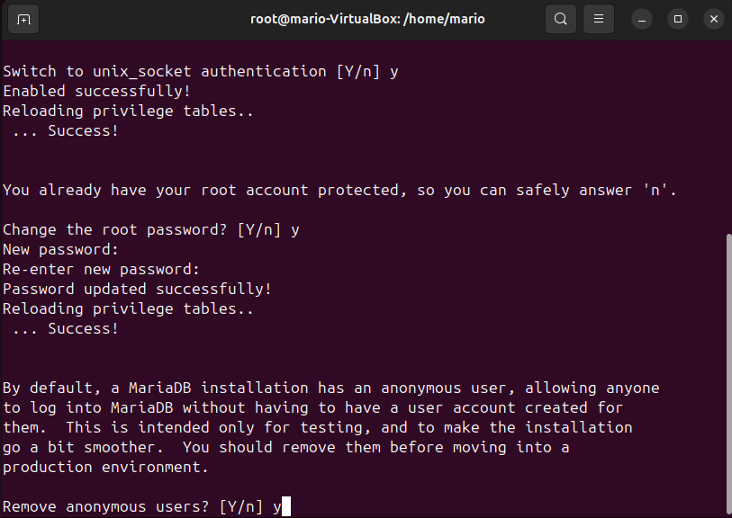
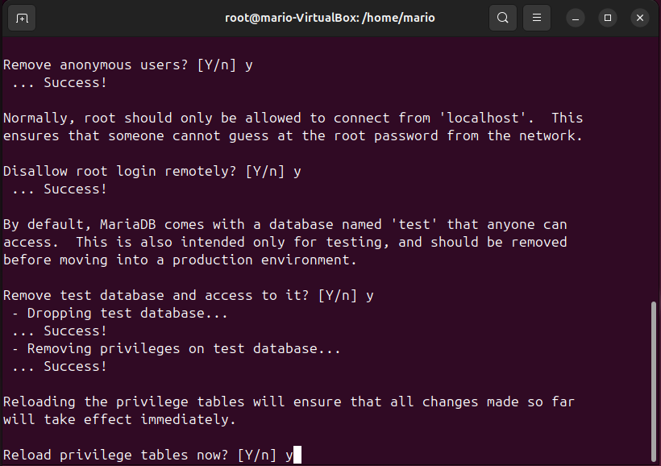
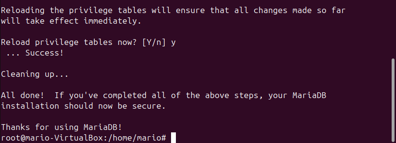

### Explicación sobre el uso de unix_socket para la autenticación

Por defecto, MariaDB utiliza el plugin unix_socket para autenticar el inicio de sesión de los usuarios. Esto significa que MariaDB no requiere una contraseña para el usuario root si el proceso de MariaDB se ejecuta con el mismo usuario del sistema operativo. Solo los usuarios del sistema con privilegios suficientes pueden acceder a la base de datos sin necesidad de una contraseña.
Prueba de acceso a la base de datos

Para acceder a MariaDB con la nueva contraseña, utilizamos el siguiente comando:
```bash
sudo mysql -u root -p
```
Luego, introducimos nuestra nueva contraseña y accedemos a la consola de MariaDB.
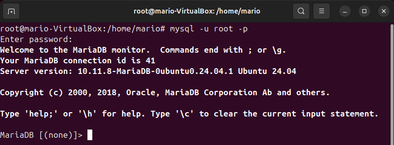

### Creación de un nuevo usuario en la base de datos

Para crear un nuevo usuario llamado developer con la contraseña 5t6y7u8i, utilizamos los siguientes comandos
```bash
CREATE USER 'developer'@'localhost' IDENTIFIED BY '5t6y7u8i';
```
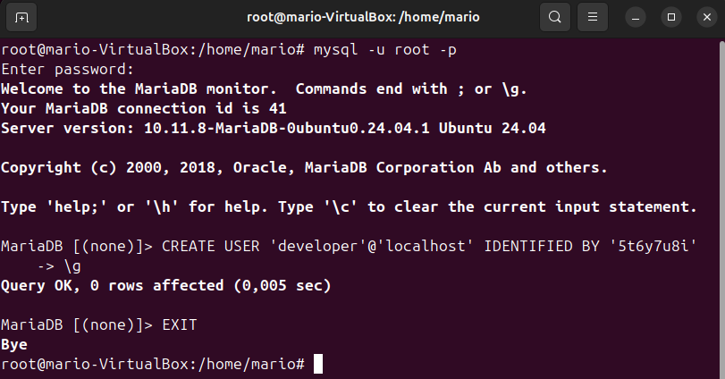

### Ingreso a la base de datos con el nuevo usuario

Para comprobar que el usuario developer tiene acceso a la base de datos, utilizamos el siguiente comando:
```bash
mysql -u developer -p
```
Luego, introducimos la contraseña 5t6y7u8i y accedemos a la consola de MariaDB.
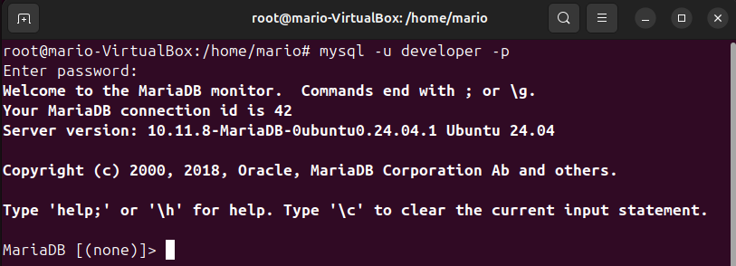

## 4. Instalación de la última versión de PHP

Para instalar PHP y algunos módulos comunes, utilizamos el siguiente comando:
```bash
sudo apt install php
```
### Activación del módulo Apache para PHP

Después de instalar PHP, debemos habilitar el módulo de Apache para PHP 7.4 y reiniciar Apache:
```bash
sudo a2enmod php8.3
sudo systemctl restart apache2
```
### Verificación de la versión de PHP

Para verificar que PHP se ha instalado correctamente, utilizamos el siguiente comando:
```bash
php --version
```

### Creación de un archivo PHP para probar la instalación

Para probar que PHP está funcionando correctamente, creamos un archivo llamado info.php en el directorio raíz de Apache:
```bash
sudo nano /var/www/html/info.php
```
Dentro de este archivo, insertamos el siguiente código:
```bash
<?php phpinfo(); ?>
```
Una vez guardado el archivo, accedemos a él desde el navegador usando la dirección http://<tu_direccion_ip>/info.php.
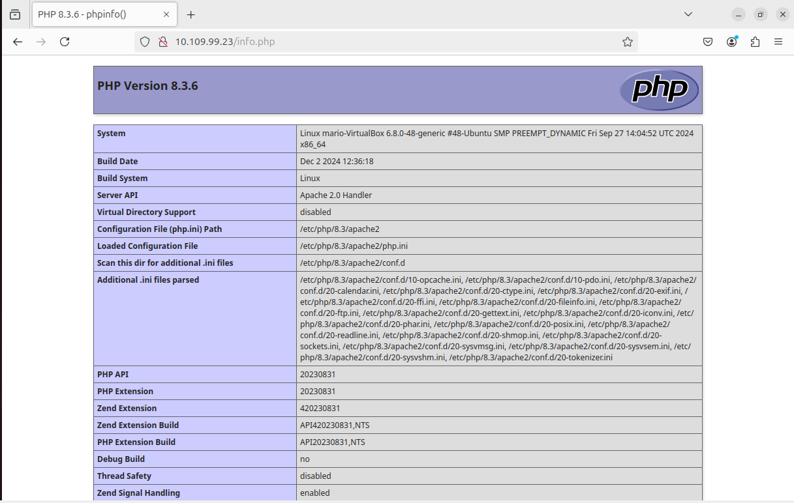

## 4.1 Ejecución de código PHP en Apache con PHP-FPM

Para ejecutar PHP con PHP-FPM, deshabilitamos el módulo PHP de Apache y habilitamos PHP-FPM:
```bash
sudo a2dismod php7.4
sudo apt install php7.4-fpm
sudo a2enmod proxy_fcgi setenvif
sudo a2enconf php7.4-fpm
sudo systemctl restart apache2
```
Luego, si actualizamos la página info.php en el navegador, veremos que la API del servidor ha cambiado de Apache 2.0 Handler a FPM/FastCGI.

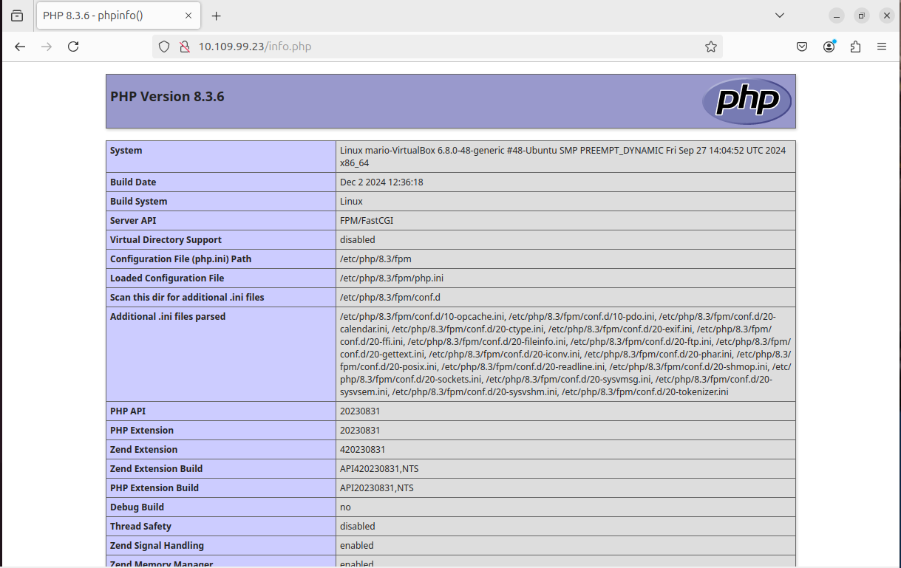
